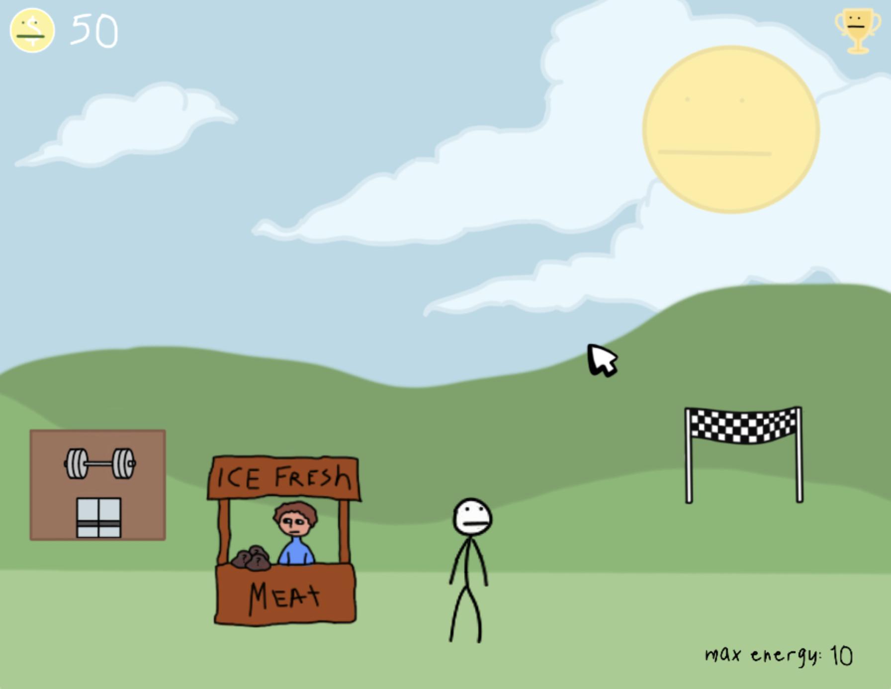
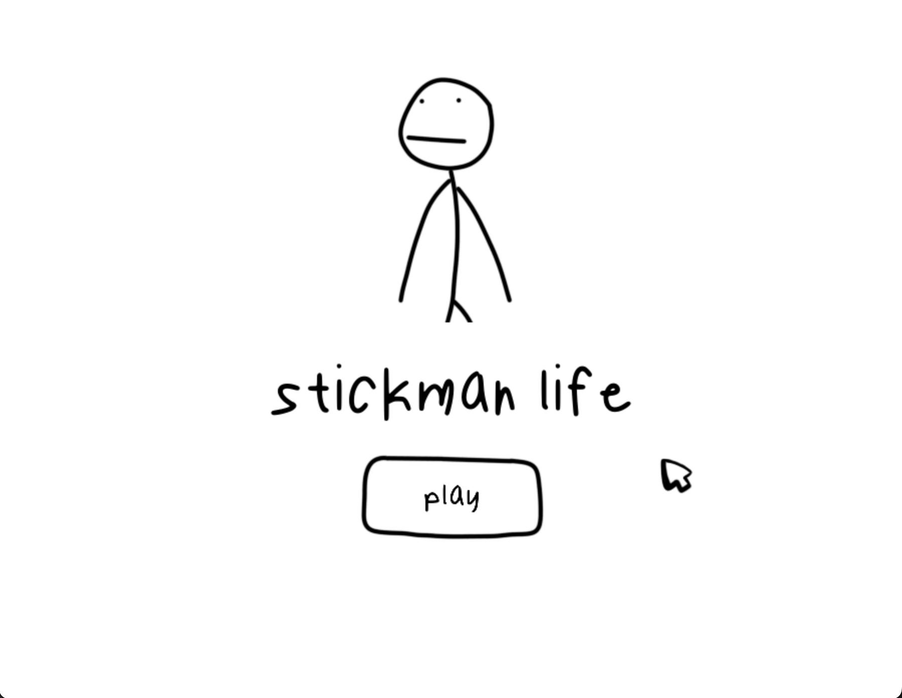

# Stickman Life

A fun rendition of the nostalgic Duck Life games.

## Background

I am currently a Sophomore in HS, as of 2023, and created this game because I was inspired by the Duck Life series. I used to play Duck Life throughout my primary school years, and really enjoyed it. To relive some of the nostalgic years, I remade a version of it with a twist: instead of ducks racing and training, it would be stickmen.

## Key Features

- Level up your stickman's stats and collect coins through four training mini-games.
- Appealing, lively graphic design.

## Upcoming Features

This project is a work in progress and is currently under active development. Some features we plan on implementing include:

1. **Character Customization**: Creating a shop where players can buy different hats/accessories for their character.

2. **Racing**: Your character will be able to race against NPCs and advance through to the championships.

## License

This project is licensed under the Creative Commons Attribution-NonCommercial-NoDerivatives 4.0 International License. To view a copy of this license, visit [CC BY-NC-ND 4.0](https://creativecommons.org/licenses/by-nc-nd/4.0/) or send a letter to Creative Commons, PO Box 1866, Mountain View, CA 94042, USA.
